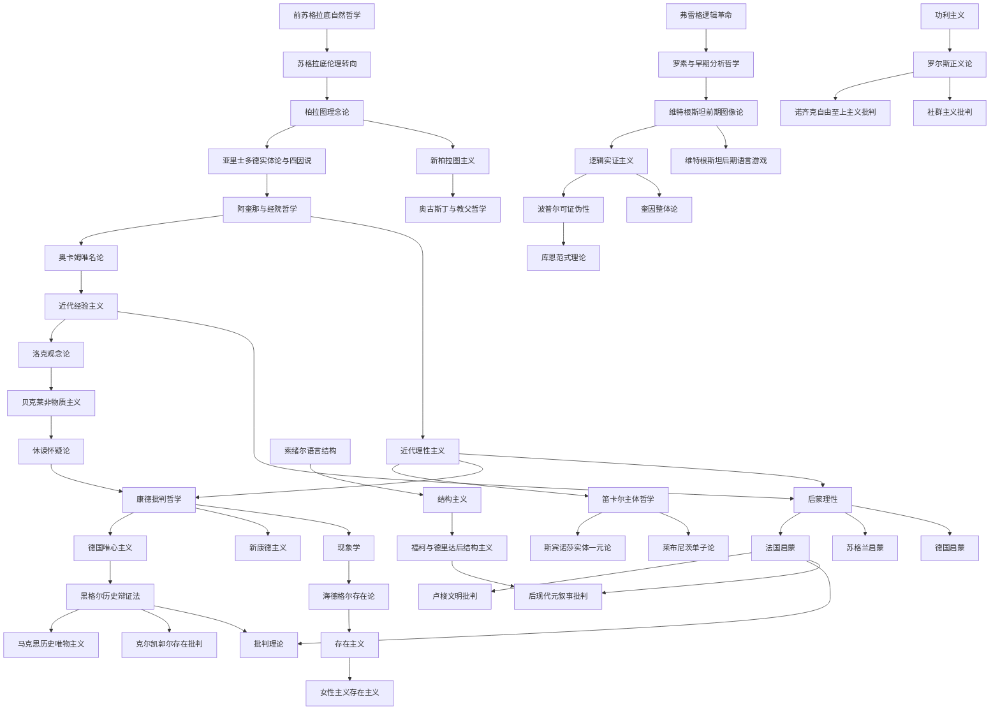

# 00 总览：如何使用这个西方哲学思想数据库

本知识库不是按人名排列的哲学家传记，也不是把哲学史压缩成结论清单。它的目标是帮助已经具备本科通识背景、但尚未系统掌握思想史细节的读者，理解西方哲学中几个长期反复出现的问题：世界究竟由什么构成，知识何以可能，理性和经验各自的边界在哪里，个人如何面对共同体，现代社会所谓进步为什么不断伴随批判和危机。这里的“数据库”并不意味着把思想分割为孤立词条；相反，它把人物、流派、作品、概念和批判关系组织成可交叉检索的结构，使读者既能顺着历史线索阅读，也能围绕一个主题横向比较。

写作遵循三个原则。第一，优先呈现论证结构，而不是只给结论。例如说康德回应休谟，不能只写“康德反驳了休谟”，还要说明休谟怎样把因果必然性还原为习惯联想，康德又如何把因果性解释为经验对象得以可能的先天范畴。第二，区分原典命题、后世解释和教学概括。许多流行表述有助于入门，但容易遮蔽复杂性，例如“正题-反题-合题”常被用来说明黑格尔辩证法，却不是黑格尔本人对其方法的标准公式；本库在使用这类教学概括时会注明其限度。第三，所有批判关系必须具体化：谁批判谁，批判的命题是什么，批判使用了什么论证，后续传统又如何继承或改写这个批判。

## 阅读方式

建议的基本路径是按章节顺序阅读。`01-ancient` 到 `03-early-modern` 提供基础语境：古希腊哲学建立本体论、伦理学和政治哲学的基本问题，中世纪哲学把希腊哲学与基督教神学结合，近代早期则通过理性主义和经验主义把认识论推到中心位置。`04-enlightenment` 是第一处重点转折：启蒙运动把哲学从学院争论扩展到宗教宽容、政治合法性、知识传播、商业社会和文明进步问题。`05-german-idealism` 到 `14-political-phil` 是本项目核心，它们展示现代哲学如何不断回应启蒙理性：德国唯心主义试图重建理性的体系性，马克思主义把理性批判转入社会实践，现象学和存在主义转向经验显现与具体生存，分析哲学转向逻辑和语言，批判理论、后结构主义和后现代主义则追问理性、知识和权力之间的关系。

第二种读法是问题导向。若关心“知识是否可靠”，可从柏拉图理念论、亚里士多德经验与形式的关系读起，再进入笛卡尔、洛克、休谟和康德，最后比较逻辑实证主义、奎因和科学哲学。若关心“现代社会为什么需要批判”，可从卢梭对文明进步的反转性批判进入，再读黑格尔承认理论、马克思异化理论、阿多诺工具理性批判、福柯知识/权力和利奥塔元叙事批判。若关心“个人自由与共同体”，可串联苏格拉底、亚里士多德、霍布斯、洛克、卢梭、康德、黑格尔、克尔凯郭尔、萨特、罗尔斯、诺齐克和社群主义。

第三种读法是使用数据文件。`data/philosophers.json` 记录人物、代表作、核心概念和流派归属；`data/schools.json` 记录流派的起止时段、核心主张和影响关系；`data/critiques.json` 记录批判链条；`data/timeline.json` 记录关键事件。随着正文扩展，脚本会生成索引和 Mermaid 图，帮助读者从文本阅读切换到结构化导航。

## 西方哲学史分期表

| 时段 | 主要章节 | 核心问题 | 典型人物与流派 |
| --- | --- | --- | --- |
| 古希腊罗马 | `01-ancient` | 本原、存在、德性、城邦、幸福生活 | 前苏格拉底、苏格拉底、柏拉图、亚里士多德、斯多葛派、伊壁鸠鲁派、怀疑派 |
| 中世纪 | `02-medieval` | 信仰与理性、创造、恶的问题、普遍者问题 | 奥古斯丁、阿奎那、奥卡姆、教父哲学、经院哲学、唯名论 |
| 近代早期 | `03-early-modern` | 主体确定性、观念来源、实体、因果、社会契约 | 笛卡尔、斯宾诺莎、莱布尼茨、霍布斯、洛克、贝克莱、休谟 |
| 启蒙运动 | `04-enlightenment` | 理性批判、宗教宽容、政治合法性、文明进步、商业社会 | 伏尔泰、孟德斯鸠、狄德罗、卢梭、休谟、亚当·斯密、康德 |
| 德国唯心主义 | `05-german-idealism` | 先验条件、自由、历史、主体与客体统一 | 康德、费希特、谢林、黑格尔 |
| 后康德与十九世纪 | `06-post-kantian`、`07-19th-century` | 个体生存、意志、价值、历史唯物主义、功利与科学 | 浪漫主义、叔本华、克尔凯郭尔、尼采、孔德、密尔、马克思、新康德主义 |
| 二十世纪欧陆哲学 | `08-phenomenology`、`11-critical-theory`、`12-structuralism`、`13-postmodern` | 显现、存在、社会批判、话语、权力、差异、元叙事 | 胡塞尔、海德格尔、萨特、波伏娃、阿多诺、哈贝马斯、福柯、德里达、利奥塔 |
| 二十世纪分析传统 | `09-analytic`、`10-pragmatism` | 逻辑、语言、意义、科学理性、实践后果 | 弗雷格、罗素、维特根斯坦、逻辑实证主义、波普尔、库恩、奎因、实用主义 |
| 当代规范理论 | `14-political-phil` | 正义、权利、共同体、性别、身份与承认 | 罗尔斯、诺齐克、麦金太尔、桑德尔、波伏娃、巴特勒 |

这个分期表只是导航工具，不应被理解为封闭边界。许多问题跨越多个时期：柏拉图的理念论会在基督教神学、德国唯心主义和分析哲学的反形而上学批判中反复出现；亚里士多德的实践哲学会在中世纪自然法、黑格尔伦理生活、麦金太尔德性伦理复兴中重新被激活；休谟的经验论不仅属于十八世纪英国哲学，也构成康德批判哲学和二十世纪科学哲学的背景。

## 主要流派谱系图

图中箭头表示影响、继承或批判的方向，并不意味着单一因果。比如康德既继承启蒙理性，又限制理性越界；卢梭既属于启蒙运动，又从内部反转启蒙进步论；福柯与德里达受到结构主义方法的训练，却通过历史化、谱系学和解构批判结构主义对稳定系统的信任。这种“从内部继承再转向批判”的模式，是现代哲学史中最重要的动力之一。

## 三条贯穿线索

第一条线索是理性与经验。古希腊哲学已经包含这组张力：巴门尼德强调存在不可变和思想把握，赫拉克利特强调流变，亚里士多德则试图在经验观察和形式解释之间取得平衡。近代以后，笛卡尔以清楚分明的理性直观寻找确定性，洛克和休谟则把知识内容追溯到经验。康德的关键贡献在于拒绝简单站队：没有经验材料，概念是空的；没有先天形式和范畴，经验是盲目的。二十世纪分析哲学和科学哲学继续重写这组张力：逻辑实证主义试图把意义约束在逻辑和经验验证之间，奎因则批判这种区分过于整齐，库恩进一步说明科学理性本身嵌入历史共同体和范式实践。

第二条线索是个体与共同体。苏格拉底的审判已经表明，哲学反省与城邦秩序之间存在紧张。柏拉图希望通过哲人王和正义城邦使灵魂秩序与政治秩序相互映照，亚里士多德则把人定义为政治动物，认为德性必须在共同体实践中养成。近代社会契约论把政治共同体理解为个体同意的产物，但霍布斯、洛克和卢梭对自然状态、权利和主权的理解差异很大。黑格尔批判抽象个人主义，强调自由必须在家庭、市民社会和国家中获得现实性；克尔凯郭尔和尼采则担心体系、群众和道德传统吞没具体个体。到当代，罗尔斯以无知之幕建构公平原则，诺齐克和社群主义分别从权利和共同体传统两个方向批判他。

第三条线索是进步与批判。启蒙运动把理性、教育、科学和制度改革视为摆脱蒙昧的道路，但卢梭从内部提出反问：文明进步是否必然带来道德进步？法国启蒙运动的乐观论与卢梭的文明批判构成现代性自我怀疑的开端。马克思继承启蒙的解放承诺，却把批判对象转向资本主义生产关系；霍克海默和阿多诺进一步追问，为什么原本旨在摆脱神话和恐惧的启蒙理性，会在现代工业社会中变成计算、控制和支配的工具？福柯和德里达不再把理性进步视为统一叙事，而是考察知识、权力和差异如何生产主体。利奥塔所谓元叙事危机，正是在这个背景下质疑启蒙以来“理性必然带来自由”的宏大故事。

## 必须掌握的批判链条

本库会反复追踪以下批判链条。康德对休谟经验论和莱布尼茨-沃尔夫理性论的双重批判，是近代认识论转入先验哲学的枢纽。黑格尔对康德物自体不可知的批判，则推动德国唯心主义试图克服现象与自在之物的裂缝。克尔凯郭尔批判黑格尔体系哲学，尼采批判苏格拉底以来理性主义传统和基督教道德，二者共同打开了存在主义和价值批判的道路。马克思批判黑格尔辩证法和费尔巴哈旧唯物主义，把哲学转向历史实践和社会关系。逻辑实证主义批判传统形而上学，后期维特根斯坦又批判自己前期的单一语言图像，奎因、波普尔和库恩则分别从经验整体论、证伪主义和范式历史批判逻辑实证主义的简化模型。

欧陆二十世纪的批判链条同样重要。霍克海默和阿多诺把启蒙理性本身作为批判对象，认为工具理性会反噬启蒙的解放承诺；哈贝马斯则批判这种悲观主义过于彻底，主张在交往理性中保留现代性的规范潜能。结构主义把主体放入语言和文化结构之中，福柯和德里达又批判结构主义的静态模型，强调历史、权力、书写和差异。利奥塔把这种怀疑推进到元叙事层面，对启蒙以来理性进步叙事提出整体质疑。在政治哲学中，罗尔斯批判功利主义可能牺牲少数人的基本自由，诺齐克和麦金太尔则分别从个人权利和共同体传统批判罗尔斯。

## 出处与引用约定

本项目不使用未经核实的具体页码，不编造原文引文。每章的“现代意义与延伸阅读”会列出经典原典和通行研究书目；正文在概括经典论点时，会标明作品名称，例如《纯粹理性批判》《精神现象学》《逻辑研究》《哲学研究》《启蒙辩证法》《正义论》等。若某一解释属于学界常见教学概括而非作者原文公式，会在正文中说明。若后续写作遇到版本、译名或史料细节不确定之处，使用“[需核实]”标记，等待查证后再定稿。

## 自动生成文件

本目录中的 `generated-index.md` 与 `generated-critique-graph.md` 由 `scripts/build_index.py` 根据 `data/*.json` 生成。手写正文负责解释关系的含义，自动文件负责提供快速导航。后续每完成一个章节，都会同步更新数据文件并重新生成这些索引。

