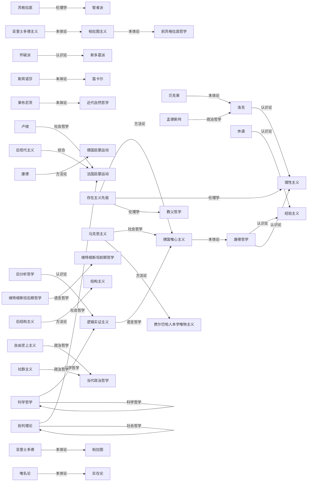

# 自动生成批判关系图

```mermaid
graph LR
  苏格拉底["苏格拉底"] -- "伦理学" --> 智者派["智者派"]
  柏拉图主义["柏拉图主义"] -- "本体论" --> 前苏格拉底哲学["前苏格拉底哲学"]
  亚里士多德主义["亚里士多德主义"] -- "本体论" --> 柏拉图主义["柏拉图主义"]
  怀疑派["怀疑派"] -- "认识论" --> 斯多葛派["斯多葛派"]
  斯宾诺莎["斯宾诺莎"] -- "本体论" --> 笛卡尔["笛卡尔"]
  洛克["洛克"] -- "认识论" --> 理性主义["理性主义"]
  贝克莱["贝克莱"] -- "本体论" --> 洛克["洛克"]
  休谟["休谟"] -- "认识论" --> 经验主义["经验主义"]
  莱布尼茨["莱布尼茨"] -- "本体论" --> 近代自然哲学["近代自然哲学"]
  卢梭["卢梭"] -- "社会哲学" --> 法国启蒙运动["法国启蒙运动"]
  孟德斯鸠["孟德斯鸠"] -- "政治哲学" --> 洛克["洛克"]
  康德["康德"] -- "方法论" --> 德国启蒙运动["德国启蒙运动"]
  康德哲学["康德哲学"] -- "认识论" --> 经验主义["经验主义"]
  康德哲学["康德哲学"] -- "认识论" --> 理性主义["理性主义"]
  德国唯心主义["德国唯心主义"] -- "本体论" --> 康德哲学["康德哲学"]
  存在主义先驱["存在主义先驱"] -- "方法论" --> 德国唯心主义["德国唯心主义"]
  存在主义先驱["存在主义先驱"] -- "伦理学" --> 理性主义["理性主义"]
  存在主义先驱["存在主义先驱"] -- "伦理学" --> 教父哲学["教父哲学"]
  马克思主义["马克思主义"] -- "社会哲学" --> 德国唯心主义["德国唯心主义"]
  马克思主义["马克思主义"] -- "方法论" --> 费尔巴哈人本学唯物主义["费尔巴哈人本学唯物主义"]
  逻辑实证主义["逻辑实证主义"] -- "语言哲学" --> 德国唯心主义["德国唯心主义"]
  维特根斯坦后期哲学["维特根斯坦后期哲学"] -- "语言哲学" --> 维特根斯坦前期哲学["维特根斯坦前期哲学"]
  后分析哲学["后分析哲学"] -- "认识论" --> 逻辑实证主义["逻辑实证主义"]
  科学哲学["科学哲学"] -- "科学哲学" --> 逻辑实证主义["逻辑实证主义"]
  科学哲学["科学哲学"] -- "科学哲学" --> 科学哲学["科学哲学"]
  批判理论["批判理论"] -- "社会哲学" --> 法国启蒙运动["法国启蒙运动"]
  批判理论["批判理论"] -- "社会哲学" --> 批判理论["批判理论"]
  后结构主义["后结构主义"] -- "方法论" --> 结构主义["结构主义"]
  后现代主义["后现代主义"] -- "综合" --> 法国启蒙运动["法国启蒙运动"]
  自由至上主义["自由至上主义"] -- "政治哲学" --> 当代政治哲学["当代政治哲学"]
  社群主义["社群主义"] -- "政治哲学" --> 当代政治哲学["当代政治哲学"]
  亚里士多德["亚里士多德"] -- "本体论" --> 柏拉图["柏拉图"]
  唯名论["唯名论"] -- "本体论" --> 实在论["实在论"]
```
